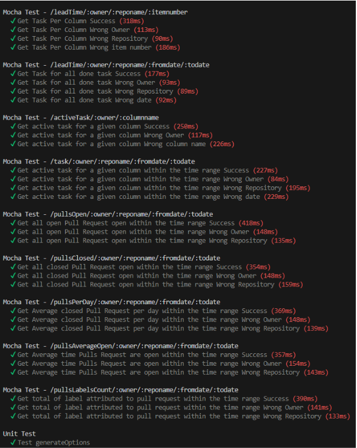

# Choix des tests et demonstrations

Pour les tests, nous avons choisi Mocha et Chai pour Node.JS puisque les framework sont très utilisés dans l’industrie.

Nous avons testé chaque API via des tests d’intégration ainsi que les fonctions utilitaires avec des tests de type UnitTest.

